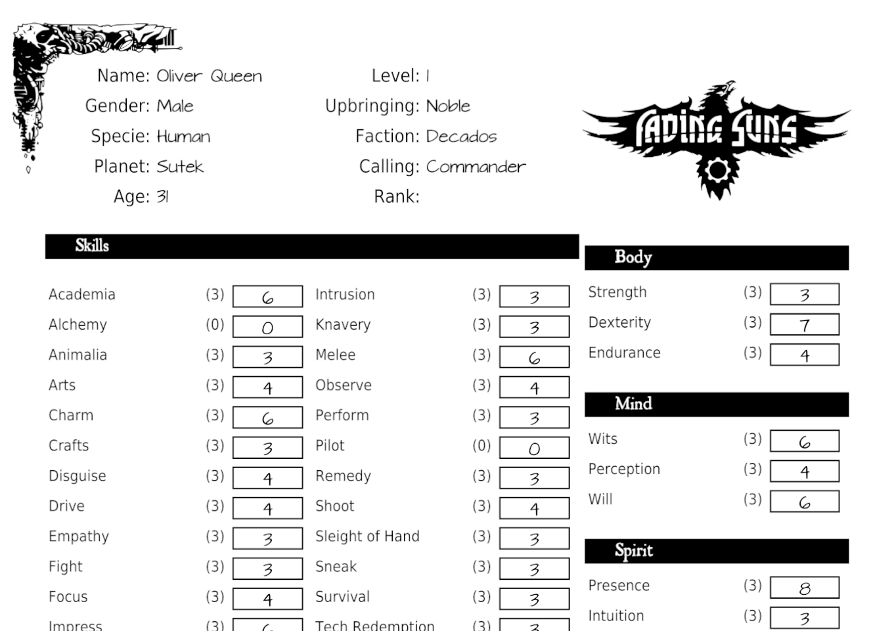

 

# Think Machine (4E)

)

This software is developed for the role-playing game **Fading Suns 4E** (4th Edition).
If you are seeking the Fading Suns 3E (Revised Edition), please visit this [link](https://github.com/softwaremagico/ThinkMachine).

The default character sheet provided in the Player's Guide book is not favored by the developer, who has created a new version inspired by older sheets from
previous editions of the game.
Additionally, custom rules for random character generation have been incorporated, suitable for both player characters (PC) and non-player characters (NPC).

This software contains only the game rules and is intended to be used as a dependency within other applications; it cannot function as a standalone program.
For a complete character generation tool, consider using **[Think Machine 4E: Advisor](https://github.com/softwaremagico/ThinkMachine-4E-Advisor)**, an Android
mobile application that offers comprehensive character creation features.

Below is a preview of the final character sheet design:

 

If you prefer this design and wish to use it, only the final PDF document is necessary. To avoid the complexity of compiling source code or using programming
languages, you can directly download the PDF from these links:

- [Character Sheet (English)](https://github.com/softwaremagico/ThinkMachine-4E/blob/master/sheets/FadingSuns_EN.pdf)
- [Character Sheet (Spanish)](https://github.com/softwaremagico/ThinkMachine-4E/blob/master/sheets/FadingSuns_ES.pdf)

The fonts required to properly view these PDFs
are: [ArchitectsDaughter](https://fonts.google.com/specimen/Architects+Daughter), [DejaVuSans](https://dejavu-fonts.github.io/),
and [Roman Antique](http://www.steffmann.de/wordpress/).
All of these fonts are available for free use in non-commercial contexts. You may need to download and install them to display the PDFs correctly.

If you prefer not to install the fonts, you can also download these sheets as PNG images by clicking any of the provided links to obtain a fully updated copy.

- [Character Sheet (English)](https://github.com/softwaremagico/ThinkMachine-4E/blob/master/sheets/FadingSuns_EN-0.png)
- [Character Sheet Reverse (English)](https://github.com/softwaremagico/ThinkMachine-4E/blob/master/sheets/FadingSuns_EN-1.png)
- [Character Sheet (Spanish)](https://github.com/softwaremagico/ThinkMachine-4E/blob/master/sheets/FadingSuns_ES-0.png)
- [Character Sheet Reverse (Spanish)](https://github.com/softwaremagico/ThinkMachine-4E/blob/master/sheets/FadingSuns_ES-1.png)

Click any of these links to get a complete updated copy of the sheet.

## Random character generation

This tool allows you to generate random character sheets, which is particularly useful for creating non-player characters (NPCs). You can specify basic options
such as nobility status, psi abilities, combat preferences, equipment, and more. The software will then produce a complete character sheet within seconds. Each
generated character strictly adheres to the rules outlined in the Fading Suns core rulebook and can be used as a standard playable character. This feature aims
to enhance your campaigns by adding variety and depth.

### Final Thoughts

This application contains the logic for defining characters and NPCs using the Fading Suns victory point rule system.
It does not include a user interface and, therefore, cannot be used as a standalone application.
In the near future, new applications with user interfaces for different platforms will be released.
These applications will be listed here:

- [Think Machine: Advisor](https://github.com/softwaremagico/ThinkMachine-Advisor) is a desktop application based on Java that integrates this library to create
  Player and Non-Player Characters (currently under development).

## Notes

This software has been developed using the [Librepdf library](https://github.com/LibrePDF) for generating PDFs.

Fading Suns is a trademark owned by Holistic Design.

The fonts used in this project are DejaVuSans, ArchitectsDaughter, and Roman Antique.

[ImageMagick](https://www.imagemagick.org/script/index.php) is free software for image manipulation.
