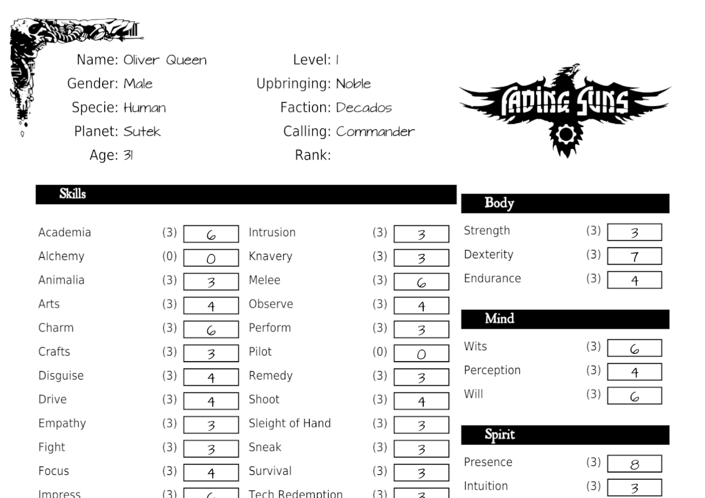

# Think Machine (4E)

)

Think Machine 4E is a Java library for the **Fading Suns 4th Edition** character system.
It provides the full rules engine, random generation utilities, and printable sheet export components as reusable modules.

If you are looking for Fading Suns 3E (Revised Edition), visit [ThinkMachine](https://github.com/softwaremagico/ThinkMachine).

## Feature Overview

### Core rules and validation

- Full character creation model based on Fading Suns 4E victory point rules.
- Rule-aware selection flow with restrictions and validation across steps.
- Support for official character structures, including options, bonuses, ranks, and level progression.
- Rich exception model for invalid selections, restricted combinations, and inconsistent builds.

### Character domain coverage

- Character foundations: species, upbringing, calling, faction, name/surname, rank, and threat level.
- Traits and mechanics: characteristics, skills and specializations, capabilities, perks, and afflictions.
- Combat and survivability: combat styles, resistances, vitality/revivals, and protections.
- Advanced systems: occultism (paths, powers, components), cyberdevices, planets/origins, and equipment economy.

### Random generation engine

- Automated random character generation for both PCs and NPCs.
- Preference-driven randomization (for example: power level, occultism, role, legal status, wealth, and affiliation).
- Random equipment, weapons, shields, armor, names, planets, and faction/career-oriented outcomes.
- Random party generation, including party composition and naming utilities.

### PDF and sheet output

- Complete printable character sheet generation in PDF format.
- Multi-language sheet assets in **English** and **Spanish**.
- Additional compact/small sheet support in the PDF module.
- Optional release pipeline conversion from PDF to PNG images (ImageMagick-based workflow).

### Modular data and content packs

- XML-based modular content loading system.
- Built-in support for multiple content books under `modules/`, including:
  - Fading Suns 4E core
  - Faction Book
  - Imperial Dossier modules (Brother Battle, Charioteers Guild, House Hawkwood, Reeves Guild)
  - Lost Worlds
  - Vuldrok Space
  - Revised Edition compatibility module

### Localization and integration

- Translation framework for multilingual element names and texts.
- Library-first architecture: no UI dependency, designed for integration into external apps/services.
- Separate Maven artifacts by capability:
  - `think-machine-4e-rules`
  - `think-machine-4e-random`
  - `think-machine-4e-pdf`
- Published using a multi-module Maven build with Java 17.

## Character Sheet Preview

Direct download:

- [Character Sheet (English PDF)](https://github.com/softwaremagico/ThinkMachine-4E/blob/master/sheets/FadingSuns_EN.pdf)
- [Character Sheet (Spanish PDF)](https://github.com/softwaremagico/ThinkMachine-4E/blob/master/sheets/FadingSuns_ES.pdf)
- [Character Sheet Front (English PNG)](https://github.com/softwaremagico/ThinkMachine-4E/blob/master/sheets/FadingSuns_EN-0.png)
- [Character Sheet Back (English PNG)](https://github.com/softwaremagico/ThinkMachine-4E/blob/master/sheets/FadingSuns_EN-1.png)
- [Character Sheet Front (Spanish PNG)](https://github.com/softwaremagico/ThinkMachine-4E/blob/master/sheets/FadingSuns_ES-0.png)
- [Character Sheet Back (Spanish PNG)](https://github.com/softwaremagico/ThinkMachine-4E/blob/master/sheets/FadingSuns_ES-1.png)

## Scope

This repository contains the core logic and export modules.
It is **not** a standalone end-user application.

For a mobile UI built on top of this library, see **[Think Machine 4E: Advisor](https://github.com/softwaremagico/ThinkMachine-4E-Advisor)**.

## Notes

- PDF generation is built with [LibrePDF / OpenPDF](https://github.com/LibrePDF).
- PNG conversion in release workflows uses [ImageMagick](https://www.imagemagick.org/script/index.php).
- Main sheet fonts: [ArchitectsDaughter](https://fonts.google.com/specimen/Architects+Daughter), [DejaVuSans](https://dejavu-fonts.github.io/), and [Roman Antique](http://www.steffmann.de/wordpress/).
- Fading Suns is a trademark owned by Holistic Design.
